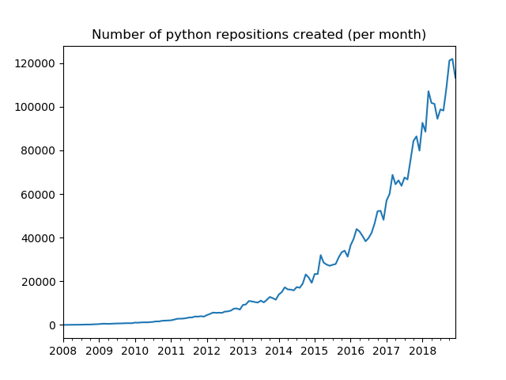
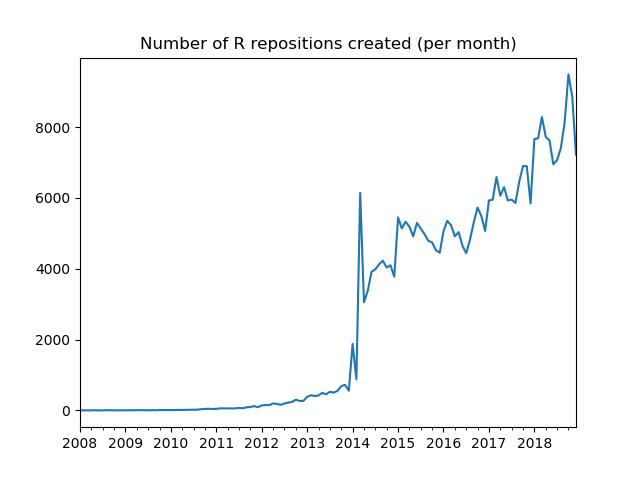
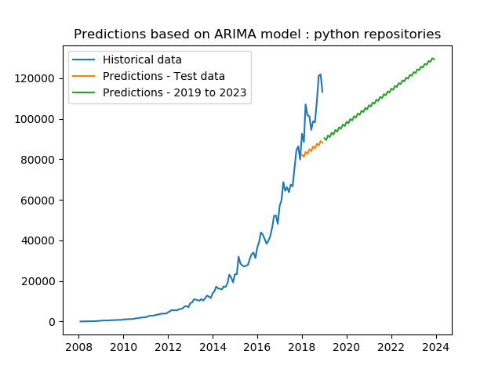
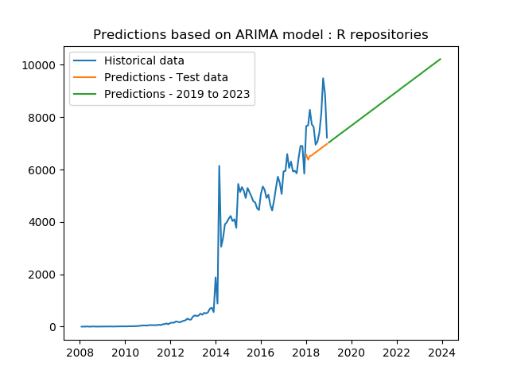
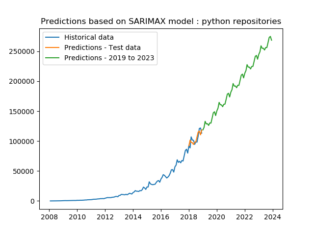
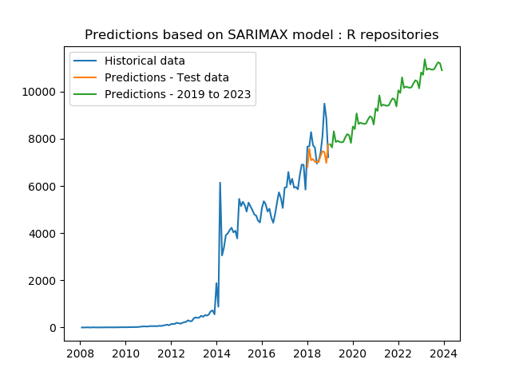

## Predicting the number of Python and R Repos that will be created over the next 5 years on Github ##

### Introduction  ###
On 31st of January, 2019 (yesterday as I write this), 59,958 new repositories were created in GitHub. Created just 10 years ago, Github is the most popular Git 
repository hosting service and has an ever increasing growth rate. This level of scaling brings a lot of technical challenges and we need to observe and predict the growth inadvance
to properly handle it.


Besides, the popularity of data science has skyrocketed in the past few years and so did the number of projects in the field. Python and R take a large share in the 
areas of data science project development. Therefore, we try to observe the growth of (Python and R) repository count over the past decade and predict the growth for the next 5 years 
using time series prediction.


### Methodology ###

1) As we need historical data on the repository counts, we use [Github GraphQL](https://developer.github.com/v4/).
2) Once we have the data, we use ARIMA and SARIMAX, two simple time series forcasting models to forcast for the next 5 years.
3) Now we build a flask API, which loads the prediction data and visualizes the forcast using Chart.js.

### Implementation ###

1) The following GraphQL query was used to fetch the Python and R monthly repository counts.

```
query{
		search(type: REPOSITORY, query: "language:$language created:$dates") {
			repositoryCount
		}
	 }
```
where language is Python or R and dates refers to monthly ranges; ex. dates = 2010-04-01..2010-05-01 refers to the month of 2010-04


2) We also need to authenticate the query request for higher rate-limit (5000 requests per hour), the OAuth token is saved in "token_file.txt" and is referred in 
[prepare_historical_data.py](prepare_historical_data.py). We can visualize the trends to get a basic intuition.





3) We now use [ARIMA](https://en.wikipedia.org/wiki/Autoregressive_integrated_moving_average), a simple yet powerful time series forcast model to predict future trends.
We take the latest 12 months as test data an observe the plots:





4) There is clear room for improvement, we now try a more complex model, SARIMAX which brings in seasonality and plot the results.






To quantisize and compare the qualities of ARIMA and SARIMAX, we calculate the RMS Error on the test set,


| Language        	| Python        | R  		|
| ------------------|:-------------:| ---------:|
| RMSE - ARIMA		| 20632.553 	| 1339.829  |
| RMSE - SARIMAX    | 7295.071 		| 975.583   |


The above table clearly illustrate how the later model predicts much better compared to the earlier, which was also seen in the plots.

5) We now create Flask APIs with /python and /r endpoints to show the best model predictions using Chart.js. 
The services can be hosted by running the following command
```
python services.py
```
Once hosted the charts can be visualized at
```
http://127.0.0.1:5001/python
http://127.0.0.1:5001/r
```
6) A Docker file is also added to simplify running the project on a docker image.

7) All the dependencies and corresponding versions are added to [requirements.txt](requirements.txt)

8) All the [results](results) are recorded for observation.